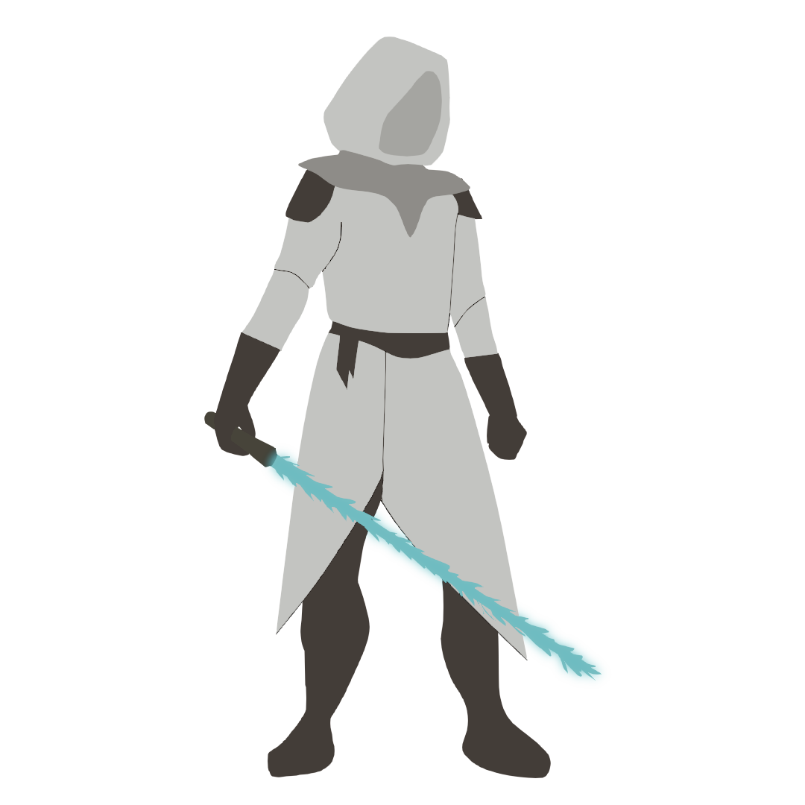
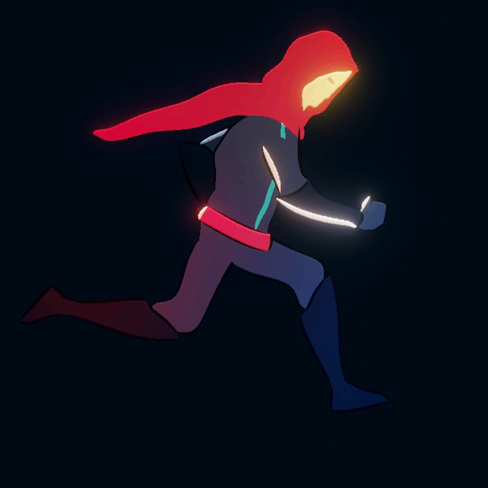

<h1 align="center"> Godo Knight </h1>  

## Why i started this project  

i wanted to try another game engine to challenge myself and learn a new thing and try to make a game with it  
and see if i can use what i learned from unity or in general, or i need a completely different view  
also i guess its cool to see how different engines work and solve different problems and what features they offer.

i will also try to make all assets like character models and animations to practice 2d art. 

--- 

  

  

### Why Godot
- Super lightweight engine
- Runs fast
- Great documentation 
- Very compact :it has its own scripting editor so no need to wait for an ide to load and connect with Godot
- Open source
- Supports multiple languages 
- Various useful tools
- Supports visual scripting 

### Apps I Use
- Godot
- Blender ( Grease Pencil )
- Krita 
